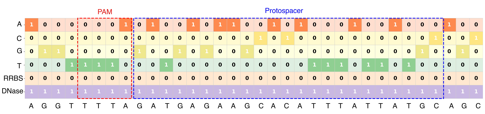

# DeepCas12a: A Deep Learning Model for AsCas12a On-Target Efficiency Prediction

DeepCas12a predicts AsCas12a on-target guide efficiency from a 34 bp target-context sequence and two epigenetic feature channels: DNA methylation and chromatin accessibility. The model encodes the input as a multi-channel sequence representation and uses a CNN-Transformer architecture for classification.

## Model Input

Each input record contains:

1. `sequence`: 34 bp target-context sequence, defined as 4 bp upstream context + PAM + 23 bp protospacer + 3 bp downstream context.
2. `methylation_status`: 34-character methylation feature string. `A` indicates methylated and `N` indicates unmethylated.
3. `dnase_signal_status`: 34-character chromatin-accessibility feature string. `A` indicates accessible and `N` indicates not accessible.
4. `label` optional: `0` for low activity and `1` for high activity.

The encoding scheme is shown below:



## Installation

Clone the repository:

```bash
git clone https://github.com/bm2-lab-submission/DeepCas12a.git
cd DeepCas12a
```

Install dependencies:

```bash
python -m pip install -r requirements.txt
```

## Quick Start

Run the provided example:

```bash
python run_example.py
```

By default, this reads `example/example_sequences.txt`, loads `trained_model/fold1.pth`, prints the input sequences with predicted labels, and writes results to `example/predictions.csv`.

For unlabeled input files:

```bash
python run_example.py --input path/to/sequences.txt --no-label --output predictions.csv
```

For a specific fold checkpoint:

```bash
python run_example.py --model trained_model/fold5.pth
```

## Data

The model-ready datasets are provided in `Dataset/` as split-specific TXT files. See `Dataset/README.md` for provenance, preprocessing, record counts, and recommended training/test usage.

The inference input format is whitespace-delimited:

```text
<34bp_sequence> <34bp_methylation_status> <34bp_dnase_status> [label]
```

See `example/example_sequences.txt` for a minimal example.

## Pre-Trained Models

The `trained_model/` directory contains nine fold checkpoints: `fold1.pth` through `fold9.pth`. These correspond to the nine cross-validation folds described in the manuscript and can be loaded individually for inference.

## Reproducibility

The repository includes the code and split files requested for reproducibility:

- DeepCas12a training: `scripts/train_deepcas12a.py`
- DeepCas12a Bayesian hyperparameter search implementation: `scripts/optuna_search_deepcas12a.py`
- CRISPR-DT baseline reproduction: `baselines/train_crispr_dt.py`
- C-SVR baseline reproduction: `baselines/train_c_svr.py`
- HT1 train/test split CSV: `splits/ht1_train_test_split.csv`
- DeepCas12a 9-fold validation partitions: `splits/deepcas12a_9fold_partitions.csv`

See `scripts/README.md`, `baselines/README.md`, and `splits/README.md` for commands and file descriptions.

## License

This project is licensed under the Apache License. See `LICENSE` for details.

## Contact

For questions or collaborations, contact 2251829@tongji.edu.cn or open an issue on GitHub.
